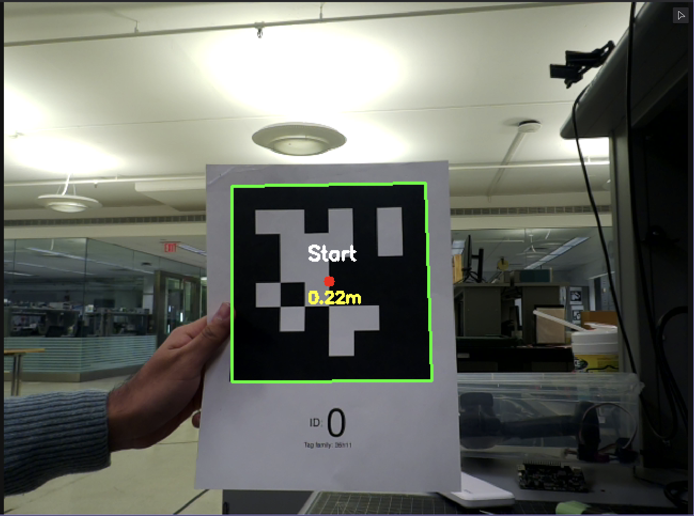
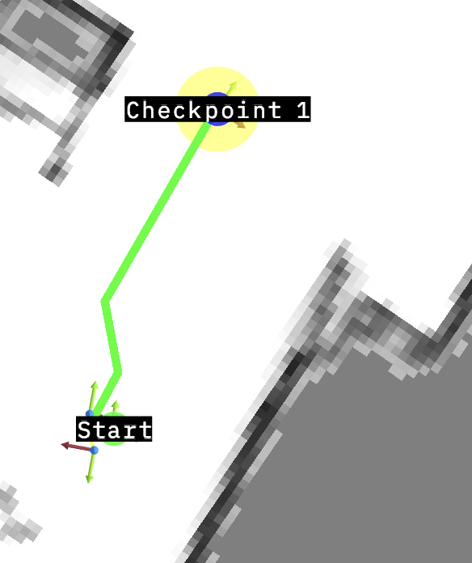

# Autonomous RC Car Navigation with SLAM

An autonomous navigation system for RC cars using ROS2, Cartographer SLAM, LiDAR+IMU sensor fusion, and AprilTag waypoint navigation. This project demonstrates real-time mapping, localization, and path planning on resource-constrained embedded hardware. This project is the final project for ECE302 at Princeton University


## Hardware

- **Compute**: Raspberry Pi 5 (8GB RAM)
- **LiDAR**: SLAMTEC A1 (360°, 6m range)
- **IMU**: BNO055 (9-DOF)
- **Camera**: Pi Camera v3 (AprilTag detection)
- **Actuation**: Brushless ESC + steering servo

## Architecture

```
┌─────────────────────┐
│   Camera + AprilTag │
│   Detection Node    │
└──────────┬──────────┘
           │ /landmarks, /tag_markers
           │
┌──────────▼──────────┐      ┌─────────────────┐
│   Cartographer      │◄─────┤  LiDAR Node     │
│   SLAM Node         │      └─────────────────┘
└──────────┬──────────┘      ┌─────────────────┐
           │                 │  IMU Node       │
           │◄────────────────┤                 │
           │ /scan, /imu     └─────────────────┘
           │
           │ /map → /odom → /base_link
           │
┌──────────▼──────────┐
│   A* Path Planning  │
│   Node              │
└──────────┬──────────┘
           │ /cmd_vel
           │
┌──────────▼──────────┐
│   Motor Controller  │
│   Node (lgpio)      │
└─────────────────────┘
           │ GPIO PWM
           ▼
    [ESC + Servo]
```

## Technical Overview

### ROS2 & Ubuntu Migration
- Used ROS2 Humble for SLAM/navigation ecosystem
- Migrated from Raspberry Pi OS → Ubuntu 24.04 for full ROS2 package support
- Leveraged Cartographer and tf2 for sensor fusion

### Transform Tree
- **Chain**: `/map` → `/odom` → `/base_link` → `/laser`, `/imu_link`, `/camera_link`
- Static transforms for sensor mounting positions
- Dynamic `/map→/odom` correction from SLAM drift compensation
- `/odom→/base_link` from IMU-based odometry

### Sensor Fusion
- **Rejected RF2O**: LiDAR-only odometry failed in featureless corridors and at slow scan rates
- **Cartographer + IMU**: 100Hz IMU fills gaps between 5-10Hz LiDAR scans
- IMU provides short-term accuracy; LiDAR provides absolute position corrections
- Complementary error characteristics eliminate drift

### Mapping


- Probabilistic occupancy grid: black=obstacles, white=free space, gray=unknown
- 0.05m resolution for A* planning
- Clean wall boundaries show effective sensor fusion

### AprilTag Navigation



- Camera detects tags using PnP algorithm from corner detection
- Multi-observation averaging reduces localization noise
- Tags stored as static waypoints in `/map` frame
- Used for both initial mapping and loop closure

### Loop Closure
- AprilTags published as `/landmarks` to Cartographer
- Unique IDs trigger pose graph optimization when revisited
- More reliable than scan-matching in repetitive environments

### A* Path Planning



- Custom implementation on occupancy grid
- Euclidean heuristic for optimal paths
- Real-time performance on Pi 5
- Smoothed paths converted to `/cmd_vel` commands

### Motor Control
- Software PWM via `lgpio` (50Hz for ESC + servo)
- Inverted ESC: 100% duty = stop, 85% = max speed
- Servo: 7.5% center ± 2.5% range
- 0.5s timeout safety mechanism

## Installation

```bash
# Ubuntu 24.04 ARM64 on Raspberry Pi 5
sudo apt install ros-humble-desktop ros-humble-cartographer-ros ros-humble-foxglove-bridge
pip3 install lgpio apriltag opencv-python numpy

cd ~/ros2_ws/src
git clone [your-repo]
cd ~/ros2_ws && colcon build && source install/setup.bash
```

## Usage

**Mapping Mode:**
```bash
ros2 launch rc_car_slam cartographer.launch.py
ros2 run rc_car_sensors camera_apriltag_node
# Drive manually to map environment
ros2 run nav2_map_server map_saver_cli -f ~/maps/my_map
```

**Autonomous Navigation:**
```bash
ros2 launch rc_car_slam autonomous_nav.launch.py map:=~/maps/my_map.yaml
```

## Team

**Aarush Goradia** - Princeton ECE
**Aaryan Jagtap** - Princeton ECE


## License

MIT License
